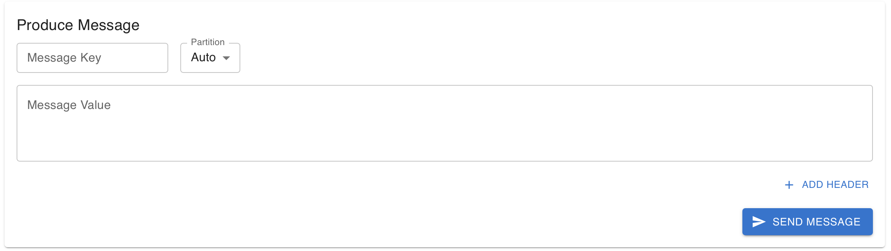

# Kafka UI

A web-based UI for managing and monitoring Apache Kafka clusters, built with Go and React.

---

## Table of Contents

- [Features](#features)
- [Project Structure](#project-structure)
- [Technology Stack](#technology-stack)
- [Prerequisites](#prerequisites)
- [Installation & Setup](#installation--setup)
- [Usage](#usage)
- [Default Credentials](#default-credentials)
- [Makefile Commands](#useful-makefile-commands)
- [Screenshots](#screenshots)

---

## Features

This application provides a comprehensive set of tools for managing and monitoring your Kafka cluster.

### Cluster Management
- **Dynamic Connection:** Connect to any Kafka broker on the fly without restarting the application.
- **Cluster Overview:** View a real-time summary of your cluster, including the number of topics, brokers, and consumer groups.
- **Broker Monitoring:** List all brokers in the cluster and view their connection details.

### Topic Management
- **View Topics:** Browse a list of all topics in the cluster.
- **Create Topics:** Create new topics with custom partition counts and replication factors.
- **Delete Topics:** Remove topics and all their messages permanently.
- **Partition Insights:** Inspect the partitions for any topic.

### Message Handling
- **View Messages:** Consume and view messages from any topic in a clean, paginated table.
- **Produce Messages:** Publish new messages to a specific topic with a key and value.
- **Delete Messages:** Clear all messages from a topic with a single click.

### Consumer Group Monitoring
- **List Consumer Groups:** View all registered consumer groups in the cluster.

### Security
- **User Authentication:** Secure access with JWT-based authentication.
- **Password Management:** Users can change their own passwords.

---

## Project Structure

```
├── backend/         # Go backend API for Kafka operations and authentication
│   ├── api/         # API route handlers (topics, messages, brokers, auth)
│   ├── kafka/       # Kafka client logic and interfaces (using Sarama)
│   ├── middleware/  # JWT authentication and bootstrap middleware
│   ├── models/      # Data models (e.g., Topic)
│   ├── utils/       # Utility functions (CSV user management, responses)
│   ├── src/         # Main entry point (main.go)
│   └── data/        # User data (users.csv)
├── frontend/        # React frontend (UI)
│   ├── src/         # Source code (components, contexts, main app)
│   │   ├── components/ # React UI components
│   │   ├── contexts/   # React Contexts for shared state (e.g., MessageFormContext)
│   │   ├── App.js      # Main app component
│   │   ├── api.js      # Axios instance for API requests
│   │   └── ...         # Other source files
│   ├── public/      # Static assets
│   ├── nginx.conf   # Nginx config for deployment (if used)
│   └── ...          # Config files, dependencies
├── Makefile         # Cross-platform build commands
└── README.md        # Project documentation
```

## Backend (Go)
- **API Endpoints:**
  - `/api/login` – JWT login
  - `/api/check-connection` – Kafka connection check
  - `/api/topics` – List topics
  - `/api/topics/:name/messages` – Get messages
  - `/api/topics/:name/partitions` – Partition info
  - `/api/produce` – Produce message
  - `/api/topics/:name/messages` (DELETE) – Delete all messages
  - `/api/topics/:name` (DELETE) – Delete topic
  - `/api/topics` (POST) – Create topic
  - `/api/consumers` – List consumers
  - `/api/brokers` – List brokers
  - `/api/change-password` – Change user password
- **Authentication:** JWT-based, user data stored in `backend/src/data/users.csv`.
- **Kafka Integration:** Uses [Sarama](https://github.com/IBM/sarama) for all Kafka operations.
- **Config:**
  - Server port via `PORT` env var (default: `8080`)
  - Kafka broker address is configured dynamically via `bootstrapServer` query parameter
  - CORS is configured to allow requests from `http://localhost:3000`
  - Protected routes require JWT authentication and bootstrap server configuration

## Frontend (React)
- **Main Features:**
  - Login/logout with JWT
  - Dynamic Kafka broker configuration
  - View, create, and delete topics
  - View and produce messages
  - View brokers and consumers
  - Change password
- **Tech Stack:** React, Material UI, Axios
- **Start:**
  - `npm install` in `frontend/`
  - `npm start` in `frontend/` (runs on [http://localhost:3000](http://localhost:3000))

## Prerequisites

### Required Software
- **Go:** 1.24.1 or later
- **Node.js:** 18.0.0 or later (LTS recommended)
- **npm:** 8.0.0 or later (comes with Node.js)
- **Git:** 2.30.0 or later (optional but recommended)

## Installation & Setup

### Windows, macOS, Linux

1. **Install Required Software**
   - Go: [golang.org/dl/](https://golang.org/dl/)
   - Node.js: [nodejs.org/](https://nodejs.org/)
2. **Clone the repository**
   ```sh
   git clone https://github.com/AnishChhetry/kafka-ui-sarama.git
   cd kafka-ui-sarama
   ```
3. **Start Backend**
   ```sh
   cd backend
   go mod tidy
   go run src/main.go
   ```
4. **Start Frontend** (in a new terminal)
   ```sh
   cd frontend
   npm install
   npm start
   ```

## Usage
- Access the UI at [http://localhost:3000](http://localhost:3000)
- The backend runs on [http://localhost:8080](http://localhost:8080) by default
- Configure the Kafka broker address in the UI before using topic/message features

## Default Credentials
- **Username:** admin
- **Password:** password

## Useful Makefile Commands

| Command                     | Description                                      |
|-----------------------------|--------------------------------------------------|
| make install-deps           | Install Go and Node.js dependencies              |
| make install-backend-deps   | Install backend (Go) dependencies                |
| make install-frontend-deps  | Install frontend (React) dependencies            |
| make start                  | Start both backend and frontend servers          |
| make stop                   | Stop all running backend and frontend processes  |
| make help                   | Shows a list of all available commands.          |

## Screenshots

Below is a gallery of the application's features in action.

| Login & Configuration |
| :---: |
|  |
|  |
| *Login and connect to your Kafka cluster.* |

| Dashboard Overview | Topic Management |
| :---: | :---: |
|  |  |
| *Get a real-time summary of your cluster.* | *View, create, and manage topics.* |

| Create Topic & View Messages | Produce Messages |
| :---: | :---: |
|  |  |
|  | *Publish messages with keys and values.* |
| *Create new topics and consume messages.* | |

| Brokers & Consumer Groups |
| :---: |
|  |
|  |
| *Monitor broker status and consumer groups.* |

| Security |
| :---: |
|  |
| *Users can manage their own credentials.* |
